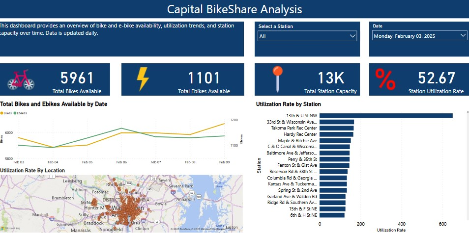

# Python Projects Collection

A collection of various Python data analysis projects.

## Projects

### 1. MovieLens Analysis
- **Description:** Analysis of movie ratings and user demographics.
- **Directory:** `/movie_analysis/`

### 2. Capital Bikeshare Data Projects

#### a) Bike Station Information
- **Description:** Retrieves static station details from the Capital Bikeshare API and stores them in a MySQL database.
- **Key Features:**
  - Extracts station names, unique IDs, geographic coordinates, region IDs, and capacity.
  - Essential for mapping station locations and analyzing infrastructure distribution.
- **Directory:** `/bike_station_information/`

#### b) Capital Bikeshare Data Collection and Analysis
- **Description:** Collects real-time bike station status data from the Capital Bikeshare API and stores it in a MySQL database. The data is later used for visualization and analysis in Power BI.
- **Key Features:**
  - Tracks bike availability, station usage patterns, and system performance.
  - Helps stakeholders make data-driven decisions for service optimization.
- **Directory:** `/capital_bikeshare_analysis/`

## Capital Bikeshare Dashboard  

Here is a preview of the Power BI dashboard:  

[Future projects will be listed here]

